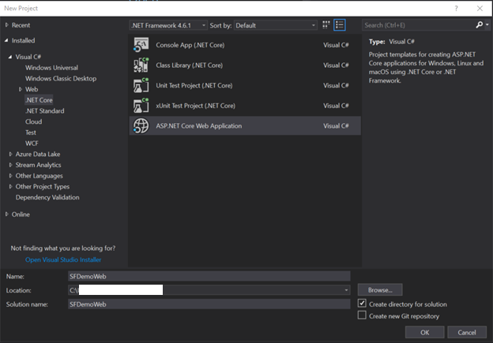
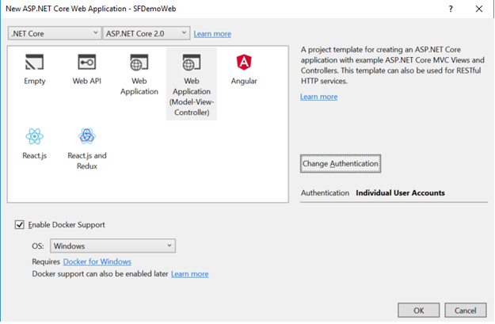
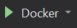
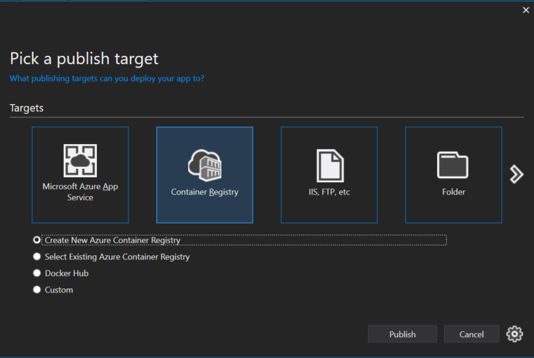
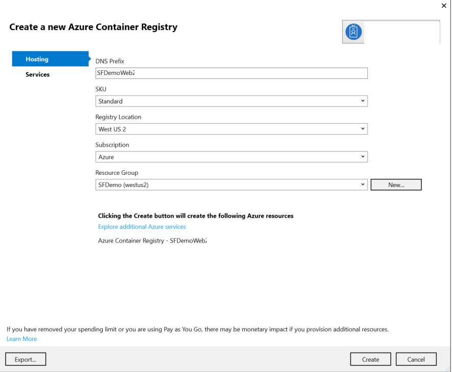
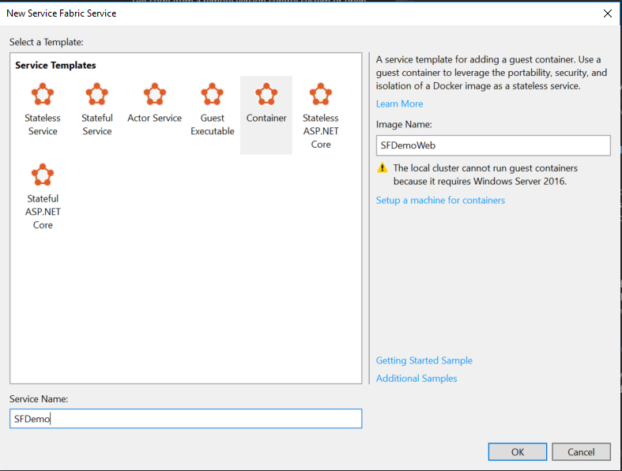
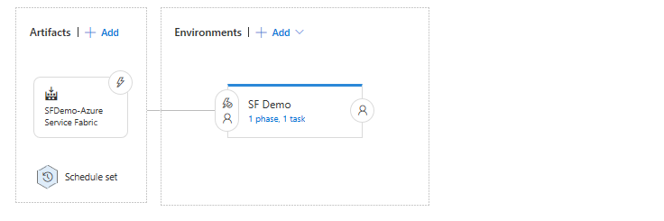

# POC Scenario:  CI/CD demonstration 
## .NET Core Application deployment with DockerCompose on Service Fabric

* [Introduction](#introduction)
* [Learning Objectives](#learning-objectives)
* [Pre-Requisites](#prerequisites)
* [Create a Secure Service Fabric Cluster](#create-a-secure-service-fabric-cluster)
* [Web and Service Fabric Project Setup](#web-and-service-fabric-project-setup)
* [Enable CI/CD in VSTS](#enable-ci/cd-in-vsts)
## Introduction
The goal of this POC is to walk the user through a basic Continuous Integration/Continuous Deployment scenario using a .NET Core web application running in a Docker container on Service Fabric.  The scenario assumes the use of the Azure Container Registry and Visual Studio Team Services (VSTS) as the repository and build/deployment engine.

## Learning objectives
After completing this exercise, you will be able to:
* Create an Azure Container Registry
* Create a secure Azure Service Fabric Cluster
* Setup a project and repository in VSTS
* Create a build definition in VSTS
* Create a deployment definition in VSTS

## Prerequisites
To complete this POC, you will need
* Access to a Microsoft Azure subscription and permissions to deploy resources
* Access to a Visual Studio 
* Visual Studio 2017
* [Docker for Windows](https://www.docker.com/docker-windows) with the Docker engine configured for Windows containers
* Azure Service Fabric SDK (latest stable release)
* [X.509 certificates to secure the cluster](https://docs.microsoft.com/en-us/azure/service-fabric/service-fabric-cluster-security) 

## Create a Secure Service Fabric Cluster
### Creating a Key Vault
To create a secure Service Fabric Cluster, first add your certificate(s) to a KeyVault.  
1. Import your certificate to your Local Computer store

**Note**  If administering your cluster using the Service Fabric Explorer, also import this certificate to the Current User store, so it will be available to be presented when challenged for a certificate.

2. Export the certificate as a password-protected PFX with the private key
3. Log on to the Azure portal
4. Create a new resource -> Key Vault
5. Enter a name for the Key Vault, a resource group and region and pricing tier.
6. Click **Create** to create the Key Vault
### Adding a certificate to KeyVault
1. In the Azure Portal, open the Key Vault resource created above
2. Click **Secrets** and **Add**
3. Select upload option **Certificate** and select the PFX file exported above.
4. Enter the password and a friendly name for the certificate and click **Create**

### Create the Secure Service Fabric Cluster
1. Log on to the Azure portal
2. Create a new resource -> Service Fabric Cluster
3. In the **Basics** blade, enter a unique cluster name.
4. **IMPORTANT** For the Operating System value, select WindowsServer 2016-Datacenter-with-Containers
5. Enter a username and password
6. Validate the subscription, resource group and region settings and click **OK**
7. In the **Cluster Configuration** blade, select the number o fnode types (1-3) and for each node type, a name and VM size.  For dev/test clusters, a single node cluster is acceptable, but not recommended for production workloads.
8. Enter any custom endpoints your application may use, as well as any advanced settings and click **OK**
9. In the **Security** blade, add the Resource ID of the Key Vault created above as the Source Key Vault value.
10. Add the Security Identifier of the certificate imported to the Key Vault under Certificate URL
11. Add the certificate thumbprint and click **OK**
12. When validation shows as successful, click **Create**

## Web and Service Fabric Project Setup
1. Open Visual Studio 2017 and create a new solution

**Important** Depending on your UAC settings, it may be necessary to run Visual Studio with elevation to build the solution.

2. Select the .NET Core ASP.NET Core Web Application and click **OK**



3. Select the Web Application (Model-View-Controller) template and select the **Enable Docker Support** option with OS type **Windows** 



4. Once the solution loads, verify that the solution builds

5. Verify that the solution runs by running the Docker debug option 

### Publish the Application to the Azure Container Registry
6. Right-click the project in Solution Explorer and select **Publish**
7. Select **Container Registry** as a target and select **Create New Azure Container Registry**



8. Enter the details for the new Azure Container Registry:  DNS Prefix, SKU, Registry Location (region), Subscription, and Resource Group.



9. Click **Create** to create and publish to the registry.

### Verify the image was pushed
1. Open an elevated PowerShell session
2. Login to your Azure account (Login-AzureRMAccount)
3. To get the Azure Container Registry endpoint, enter the following PowerShell command
``` Powershell
Get-AzureRmContainerRegistry -ResourceGroupName yourRG -name yourACRName
```
Note the LoginServerValue

4. To get the Azure Container Registry credentials, enter the following PowerShell command
``` Powershell
get-AzureRMContainerRegistryCredential -ResourceGroupName yourRG -name yourACRName
```
Note the Username and Password values

5. Enter the following docker commands to view the image in the repository
```
docker login yourendpoint.azurecr.io -u username -p password
docker images
```
The application image should appear in the docker images list.

### Commit changes
1. In Visual Studio, commit the changes to your Git project repository in VSTS

### Create the Service Fabric application
 1. Open a new instance of Visual Studio 2017
 2. Select the Service Fabric Application template
 3. Select the **Container** Service Template and enter a Service and Image Name

 

 4. Open the ServiceManifest.xml file and edit the endpoint created by the template above with the port/protocol information desired.
 Example:
 ```XML 
 <Endpoint Name="SFDemo" UriScheme="http" Port="443" Protocol="https" />
 ```

 5. Open the ApplicationManifest.xml file and add a Policies node under ServiceManifestImport.
 6. Policies/ContainerHostPolicies should contain an element PortBinding which references the endpoint created in the ServiceManifest.xml file
 7. Policies/ContainerHostPolicies should contain a RepositoryCredentials element with username/password information to the image container.
 Example:
 ```XML
  <Policies>
      <ContainerHostPolicies CodePackageRef="Code">
        <PortBinding ContainerPort="443" EndpointRef="AzureCRTypeEndpoint"/>
        <RepositoryCredentials  AccountName="ContosoExpenseWebFoo" Password="!!!tZHuaEG/7bHpOn9DgScPCUcm38QaD" PasswordEncrypted="true"/>
      </ContainerHostPolicies>
    </Policies>
 ```
 8. Test the configuration by right-clicking the Service Fabric project and selecting **Publish**
 9. Select the **Cloud.xml** publish profile
 10. Enter theAzure credentials.  The Service Fabric Cluster created earlier should appear in the **Connection Endpoint** drop down.
 11. Selecting **Advanced Connection Parameters** should display the certificate information for the certificate used to create the cluster
 12. Click **Publish** to publish the application
 13. Verify the application health in the Service Fabric Explorer

 ## Enable CI/CD in VSTS
 ### Creating the Build Definition
 1. Log in to the VSTS portal and select the project created for this POC.
 2. Click **Builds** and **New**
 3. From the Build Template list, select the **Azure Service Fabric Application with Docker Support** template
 
 4. Under the **Agent Queue** settings, select **Hosted VS2017*
 5. Add the NuGet Tool Installer build task to the build definition and move to the top of the build process.  This will ensure the latest NuGet agent is installed
 6. Select the Docker **Push Images** task 
 7. Change **Action** to **Push an Image**
 8. Change **Container Registry Type** to **Azure Container Registry**
 9. Select the Azure subcription and container registry for the solution
 
 **Note** This may require setting up a new connection to your Azure subscription in VSTS
 
 10. Select the **Update Service Fabric Manifests (Docker Image Settings)** task
 11. In **Application Package** select the ProjectName/ProjectName/ApplicationPackageRoot path
 
 12. Click **Triggers** and select the **Enable Continuous Integration** check box
 13. Save and Queue the build

###Creating the Release Definition

 1. Once the build definition is created and building successfully, click **Build and Release** and select **Releases**
 2. Click the **+** icon and select **Create Release Definition**
 3. Select the **Azure Service Fabric Compose Deployment** release template
 4. Click **Artifacts** and select **Add**
 5. Add the Build Definition created in the earlier step.
 
 **Optional** Set a schedule in the artifacts if a release schedule is desired.
 
 6. In the pipeline view, click into the Environment
 7. Click **+New** to configure a connection to the Service Fabric cluster
 
 8. Click the **Deploy docker-compose application to a Service Fabric cluster** phase and select the Azure subscription.
 9. Click **Save**
 10. Click **Create new release** and select the environment and artifacts created above to create a new release to test the release.
 
 
